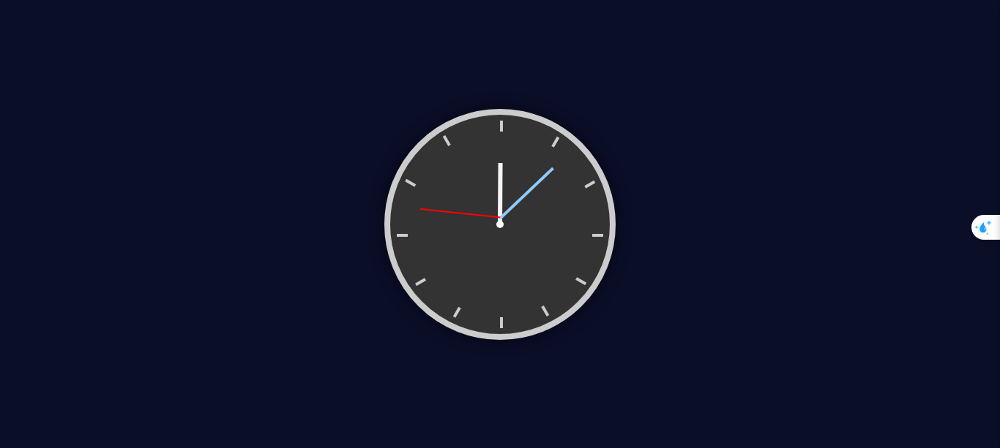

# Clock Project

This project is a **CSS** and **HTML-based analog clock** created to simulate a real watch face with animated hour, minute, and second hands. The clock includes hour markers and a stylish circular design. It’s a great example of **CSS animations** and **transformations**, showing how to simulate real-world motion in a visually appealing way.

## Features

- **Realistic Clock Design**: Includes a circular clock face with hour markers for each hour, from 1 to 12.
- **Smooth Animations**: The second, minute, and hour hands rotate smoothly using CSS animations to replicate a working clock.
- **Simple and Elegant UI**: Styled for a classic look, the clock features a clean and minimalist design.
- **Dynamic Rotations**: The hands rotate continuously based on real-world time ratios:
  - **Seconds hand**: Rotates every 60 seconds.
  - **Minutes hand**: Rotates every 60 minutes.
  - **Hours hand**: Rotates every 12 hours.

## Preview

Here's a screenshot of the clock interface:

